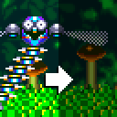

# Screen Dimming Feature

Idle screen dimming feature from Sonic Mania Plus for Sonic 3 A.I.R.

## List of features:

* Works in all game screens (except A.I.R menus).

* Option to select the rendering method: 400 x 224 (Default), By screen size (Hardware only).

* Option for allowing to set how long it takes for the screen to dim.

## FAQ: 

Q. The mod does not work. The screen does not dim.  
A. Make sure 1. The mod is set in priority over other mods, 2. Whether the Screen dimming option is enabled in the settings, 3. How long the wait is set.

Q. I noticed a bug, where can I contact?  
A. Contact me in the comments of Gamebanana, GitHub issues, or via Discord on the Sonic 3 A.I.R modding server. Try to describe the problem in more detail.